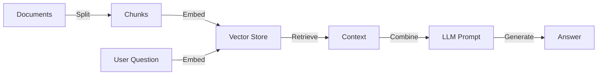

# Day 1: Foundations of Agentic AI - RAG and Vector Stores

Welcome to the first day of our 4-day series on building Agentic AI applications with **LangChain** and **LangGraph**. Over this series, we will evolve a simple script into a sophisticated, human-in-the-loop multi-agent system.

Today, we start with the bedrock of modern AI apps: **Retrieval Augmented Generation (RAG)**.

## The Problem: LLMs Have Amnesia
Large Language Models (LLMs) like GPT-4 are frozen in time. They don't know about your private data, your company's wiki, or the news from this morning. If you ask them about it, they might "hallucinate" (make things up).

## The Solution: RAG
RAG is a technique to "inject" knowledge into the LLM's prompt before it answers. It works in two phases:
1.  **Ingestion**: Preparing your data for search.
2.  **Retrieval**: Finding the right data and sending it to the LLM.

Let's build this from scratch using LangChain.

## Prerequisites
Ensure you have the dependencies installed:
```bash
npm install @langchain/openai langchain dotenv
```

## The RAG Architecture


### Step 1: Loading and Splitting Data
LLMs have a "context window" (a limit on how much text they can read). We can't just feed an entire book. We need to break it down.

**Key Utilities:**
*   `TextLoader`: Reads files from disk.
*   `RecursiveCharacterTextSplitter`: Smartly breaks text into chunks (e.g., 200 characters) while trying to keep paragraphs together.

```javascript
import { TextLoader } from "langchain/document_loaders/fs/text";
import { RecursiveCharacterTextSplitter } from "langchain/text_splitter";

// 1. Load the file
const loader = new TextLoader("info.txt");
const docs = await loader.load();

// 2. Split into chunks
const splitter = new RecursiveCharacterTextSplitter({
  chunkSize: 200,    // Characters per chunk
  chunkOverlap: 20,  // Overlap to preserve context between chunks
});
const splitDocs = await splitter.splitDocuments(docs);
```

### Step 2: Embeddings and Vector Stores
How do we search these chunks? Keyword search (Ctrl+F) is brittle. Instead, we use **Semantic Search**.
We convert text into **Embeddings** (lists of numbers) where similar concepts are mathematically close.

**Key Utilities:**
*   `OpenAIEmbeddings`: Turns text into vectors (arrays of numbers).
*   `MemoryVectorStore`: A simple in-memory database to store these vectors.

```javascript
import { OpenAIEmbeddings } from "@langchain/openai";
import { MemoryVectorStore } from "langchain/vectorstores/memory";

// 3. Index the chunks
const vectorStore = await MemoryVectorStore.fromDocuments(
  splitDocs,
  new OpenAIEmbeddings()
);
```

### Step 3: The Retrieval Chain
Now we connect everything. When a user asks a question:
1.  Turn the question into an embedding.
2.  Find the most similar chunks in the `VectorStore`.
3.  Paste those chunks into a prompt template.
4.  Send it to the LLM.

LangChain abstracts this with `createRetrievalChain`.

```javascript
import { createStuffDocumentsChain } from "langchain/chains/combine_documents";
import { createRetrievalChain } from "langchain/chains/retrieval";

// Create the "Answerer" (LLM + Prompt)
const combineDocsChain = await createStuffDocumentsChain({
  llm: model,
  prompt: ChatPromptTemplate.fromTemplate(`
    Answer based on this context:
    {context}
    
    Question: {input}
  `),
});

// Create the full pipeline (Retriever + Answerer)
const retrievalChain = await createRetrievalChain({
  retriever: vectorStore.asRetriever(),
  combineDocsChain,
});

// Run it!
const response = await retrievalChain.invoke({
  input: "What is LangGraph inspired by?",
});
```

## Summary
You've just built a system that can "read". It doesn't rely on the LLM's training data alone; it uses **your** data. This is the foundation. Tomorrow, we will stop treating this as a linear script and turn it into an **Agent** that can decide *when* to use this knowledge.
