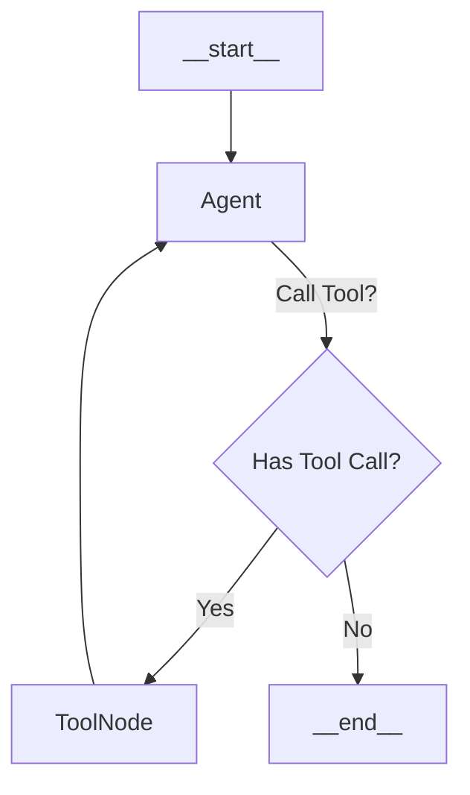

# Day 2: Introduction to LangGraph - From Chains to Agents

Yesterday, we built a **Chain**. It was a straight line: `Input -> Retrieve -> Answer`.
But real life isn't a straight line. Sometimes you need to loop. Sometimes you need to skip steps. Sometimes you need to stop and ask for clarification.

This is where **LangGraph** comes in. It treats your AI application as a **Graph** (nodes and edges) rather than a Chain (a list of steps).


## Core Concepts of LangGraph

### 1. State
In a Chain, data flows from one step to the next like a bucket brigade. In LangGraph, there is a central **State** object that everyone reads from and writes to. It's like a shared whiteboard.

```javascript
// The State is just a list of messages
import { MessagesAnnotation } from "@langchain/langgraph";
// MessagesAnnotation is a pre-built state definition for chat apps.
```

### 2. Nodes
Nodes are just JavaScript functions. They take the current `State`, do some work, and return an update to the `State`.

```javascript
const agentNode = async (state) => {
  // Read the history
  const { messages } = state;
  // Call the LLM
  const response = await model.invoke(messages);
  // Update the state (append the new message)
  return { messages: [response] };
};
```

### 3. Edges and Conditional Edges
Edges define the flow.
*   **Normal Edge**: "After A, always go to B."
*   **Conditional Edge**: "After A, check the result. If X, go to B. If Y, go to C."

This is how we build **Agents**. An Agent is just a loop:
1.  LLM thinks.
2.  **Conditional Edge**: Did the LLM ask to call a tool?
    *   **Yes**: Go to `ToolNode`.
    *   **No**: End.
3.  `ToolNode` executes the tool and loops back to step 1.

## Visualizing the Graph


## Building the Graph

We will wrap our RAG code from Day 1 into a **Tool**. This gives the LLM the *option* to search, rather than forcing it to.

```javascript
// 1. Define the Graph
const workflow = new StateGraph(MessagesAnnotation)
  
  // Add Nodes
  .addNode("agent", agentNode)
  .addNode("tools", new ToolNode([lookupPolicy])) // A pre-built node that runs tools
  
  // Define Flow
  .addEdge("__start__", "agent") // Start here
  
  // The Brain: Decide what to do next
  .addConditionalEdges("agent", (state) => {
    const lastMessage = state.messages[state.messages.length - 1];
    // If the LLM returned a "tool_call", go to "tools"
    if (lastMessage.tool_calls?.length) {
      return "tools";
    }
    // Otherwise, we are done
    return "__end__";
  })
  
  // The Loop: After tools, always go back to the agent to interpret the results
  .addEdge("tools", "agent");

// 2. Compile
const app = workflow.compile();
```

## Why is this better?
1.  **Autonomy**: The LLM decides *if* it needs to search. If you say "Hi", it just says "Hi back" (cheap/fast). If you ask a hard question, it searches (thorough).
2.  **Cycles**: If the first search result wasn't good enough, the Agent can decide to search *again* with a different query. A linear chain can't do that.

Tomorrow, we will expand this graph to include multiple agents working together!

## Source Code
- [agent.js](https://github.com/RaviDasari/learn-ai-langgraph/blob/main/day2-langgraph/agent.js)
