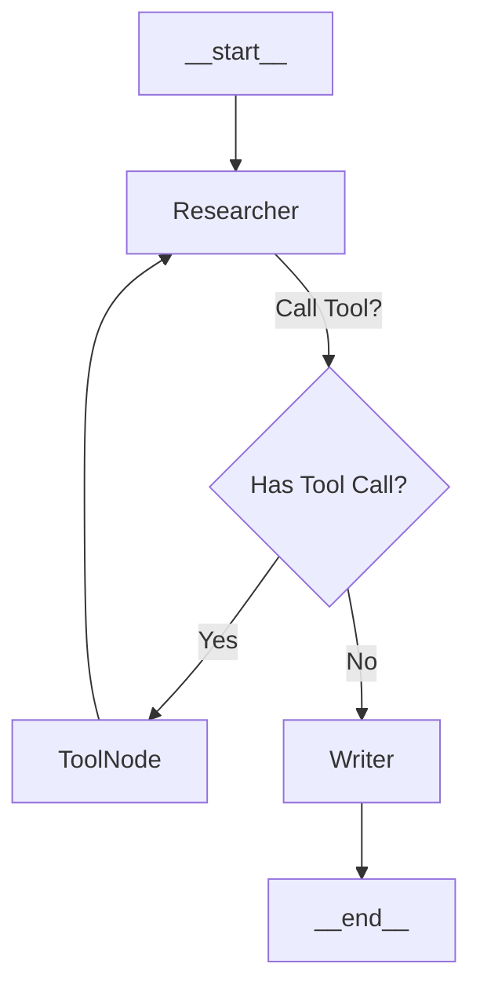

# Day 3: Multi-Agent Systems - The Supervisor Pattern

Welcome to Day 3. We have a single agent that can use tools. But as tasks get complex, a single prompt becomes overwhelmed. It's hard to be a "Researcher, Writer, Editor, and Coder" all at once.

The solution is **Multi-Agent Systems**. We break the brain into specialized distinct personas.

## The Architecture: Researcher & Writer
We will build a graph where two agents collaborate:
1.  **Researcher**: Has access to search tools. Its system prompt is "You are a researcher...".
2.  **Writer**: Has NO tools. Its system prompt is "You are a writer...".

They communicate by adding messages to the shared **State**.

### 1. Creating Specialized Agents
We use a helper function to create nodes. Notice how we `bindTools` only to the Researcher. The Writer doesn't even know tools exist, which prevents it from hallucinating tool calls.

```javascript
const createAgent = (model, systemPrompt, tools = []) => {
  const modelWithTools = model.bindTools(tools);
  return async (state) => {
    // We prepend the system prompt to the history
    const messages = [
      new SystemMessage(systemPrompt),
      ...state.messages,
    ];
    const response = await modelWithTools.invoke(messages);
    return { messages: [response] };
  };
};
```

### 2. The Handoff (Routing)
In a sophisticated system, a "Supervisor" LLM would decide who speaks next. For this tutorial, we'll implement a **deterministic flow** to understand the mechanics:
`Researcher -> (maybe Tools) -> Researcher -> Writer -> End`

## Visualizing the Team


This is implemented via edges in LangGraph:

```javascript
const workflow = new StateGraph(MessagesAnnotation)
  .addNode("researcher", researcherNode)
  .addNode("tools", toolNode)
  .addNode("writer", writerNode)

  // Start with Research
  .addEdge("__start__", "researcher")

  // Researcher Logic:
  // If it calls a tool -> go to "tools"
  // If it has an answer -> hand off to "writer"
  .addConditionalEdges("researcher", (state) => {
    const last = state.messages[state.messages.length - 1];
    return last.tool_calls?.length ? "tools" : "writer";
  })

  // Tools always return results to the Researcher
  .addEdge("tools", "researcher")

  // Writer always finishes the job
  .addEdge("writer", "__end__");
```

## The Power of Shared State
The magic happens in `MessagesAnnotation`.
1.  Researcher adds: "I found X, Y, Z."
2.  Graph transitions to Writer.
3.  Writer receives `[UserMessage, ResearcherMessage]`.
4.  Writer generates: "Here is a blog post about X, Y, Z..."

The Writer didn't need to search. It just "read" what the Researcher "wrote" in the shared state. This separation of concerns allows you to tune each agent individually (e.g., set `temperature: 0.8` for the Writer for creativity, but `0` for the Researcher for accuracy).
