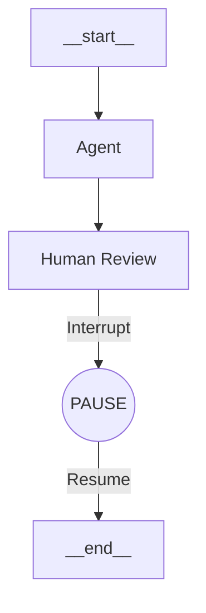

# Day 4: Production Patterns - Persistence and Human-in-the-Loop

Welcome to the final day. We have a smart team of agents. But in the real world, scripts crash, users get distracted, and sometimes the AI makes a mistake that a human needs to catch.

Today we cover two critical features for production apps: **Persistence** (Memory) and **Human-in-the-Loop**.

## 1. Persistence (Time Travel)
Standard scripts lose all memory when they finish. LangGraph has a built-in **Checkpointer** system. It saves the `State` to a database (or memory) after *every single step*.

This allows:
1.  **Long-running conversations**: Like ChatGPT threads.
2.  **Resume on failure**: If the app crashes, you can reload the state and continue.
3.  **Time Travel**: You can actually go back to a previous step and try a different path!

```javascript
import { MemorySaver } from "@langchain/langgraph";

// Ideally use PostgresSaver or RedisSaver in production
const checkpointer = new MemorySaver();

const app = workflow.compile({ checkpointer });

// We MUST provide a thread_id to identify the session
const config = { configurable: { thread_id: "session-123" } };
```

## 2. Human-in-the-Loop (Interrupts)
We don't want our Writer agent to auto-publish a tweet. We want to review it first.
LangGraph allows us to **Interrupt** the graph execution before entering a specific node.

```javascript
const app = workflow.compile({
  checkpointer,
  // STOP execution right before entering the "human_review" node
  interruptBefore: ["human_review"], 
});
```

### The Workflow


1.  **Run**: The user asks for a tweet.
2.  **Pause**: The Agent drafts it, and the graph stops at `human_review`. The script literally exits or yields.
3.  **Inspect**: The user (or UI) fetches the current state.
    ```javascript
    const state = await app.getState(config);
    console.log("Draft:", state.values.messages.at(-1).content);
    ```
4.  **Resume**: The user approves (or edits) and we tell the graph to continue.
    ```javascript
    import { Command } from "@langchain/langgraph";
    
    // Resume execution
    await app.invoke(
      new Command({ resume: "Approved" }), 
      config
    );
    ```

## Conclusion
You have now built a full-stack Agentic Architecture:
*   **Day 1**: Grounded knowledge with **RAG**.
*   **Day 2**: Decision making with **StateGraph**.
*   **Day 3**: Specialization with **Multi-Agent** routing.
*   **Day 4**: Reliability with **Persistence** and **Human Control**.

This is the blueprint for modern AI applications. You are no longer just "prompting"; you are architecting cognitive systems.
